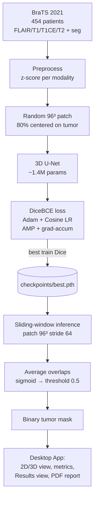

# Brain Tumor Segmentation — Complete Project Overview

> **Read this first.** This single document explains the **entire project end to end**:
> from the raw MRI dataset, through how the 3D deep-learning model is trained, to the
> desktop application that runs the trained model and produces a report. If you are new
> to this repository, reading this top-to-bottom will give you the full mental model of
> how every piece fits together.

---

## Table of Contents

1. [What this project does (in one minute)](#1-what-this-project-does-in-one-minute)
2. [The big-picture flowchart](#2-the-big-picture-flowchart)
3. [Repository layout](#3-repository-layout)
4. [Part A — The data (BraTS 2021 MRI)](#part-a--the-data-brats-2021-mri)
5. [Part B — Preprocessing & patch sampling](#part-b--preprocessing--patch-sampling)
6. [Part C — The model (3D U-Net)](#part-c--the-model-3d-u-net)
7. [Part D — Training in detail](#part-d--training-in-detail)
8. [Part E — Inference (sliding-window prediction)](#part-e--inference-sliding-window-prediction)
9. [Part F — The desktop application](#part-f--the-desktop-application)
10. [Part G — The Results section outputs](#part-g--the-results-section-outputs)
11. [Part H — How to run everything](#part-h--how-to-run-everything)
12. [Metrics explained](#metrics-explained)
13. [Key points cheat-sheet](#key-points-cheat-sheet)
14. [Limitations & honest notes](#limitations--honest-notes)

---

## 1. What this project does (in one minute)

- **Goal:** given a patient's brain MRI scan, automatically find (segment) the tumor.
- **Input:** 4 MRI "modalities" (different scan types) of the same brain — FLAIR, T1, T1CE, T2.
- **Output:** a 3D **whole-tumor mask** — for every voxel (3D pixel), a decision: *tumor* or *not tumor*.
- **How:** a **3D U-Net** convolutional neural network, trained on the **BraTS 2021** dataset.
- **Deliverable:** a **PyQt6 desktop app** ("Brain Tumor Segmentation Studio") that loads a patient,
  runs the trained model, shows 2D/3D visualizations + metrics, and exports a full PDF report.

**One key clarification (important for the write-up / viva):**
This model does **not** do image-level classification (like "this image is a cat"). It does
**semantic segmentation** — its final layer classifies **each voxel independently** as tumor or
not. The "classification layer" is the final `1×1×1 Conv3d + sigmoid`.

---

## 2. The big-picture flowchart

```
                         ┌─────────────────────────────────────────────────┐
                         │                 TRAINING PHASE                   │
                         │              (done once, offline)                │
                         └─────────────────────────────────────────────────┘

  BraTS 2021 dataset            Preprocessing              Patch sampling
  454 patients          ─────►  z-score normalize   ─────► random 96³ crops     ─────┐
  each: FLAIR,T1,T1CE,T2        per modality               biased 80% toward tumor    │
  + seg (ground truth)          (brain voxels only)        (data_loader.py)           │
                                                                                      ▼
        ┌──────────────────────────────────────────────────────────────────────────────┐
        │  3D U-Net (model.py)  ──►  DiceBCE loss  ──►  Adam + CosineAnnealing            │
        │  patch in [1,4,96,96,96]   backprop           mixed precision (AMP)             │
        │  logits out [1,1,96,96,96] (utils.py)         gradient accumulation (train.py)  │
        └──────────────────────────────────────────────────────────────────────────────┘
                                                                                      │
                                                    saves best model  ───────────────►│
                                                                                      ▼
                                                              checkpoints/best.pth
                                                              (epoch 36, Dice ≈ 0.847)

                         ┌─────────────────────────────────────────────────┐
                         │             INFERENCE + APP PHASE                │
                         │            (what the user runs)                  │
                         └─────────────────────────────────────────────────┘

  Load 1 patient        Sliding-window inference        Post-process           Visualize + report
  (4 modalities)  ─────► slide 96³ patch, stride 64 ───► average overlaps  ───► 2D viewer, 3D viewer,
  normalize             run model on each patch          sigmoid → threshold    metrics, PDF report
  (utils.py in app)     stitch predictions back          0.5 → binary mask      (inference_app/…)
                        (predict.py / prediction_worker.py)
```

**Mermaid version** (renders on GitHub / Mermaid-aware viewers):



---

## 3. Repository layout

```
brain_tumor_segmentation/
├── COMPLETEOVERVIEW.md        ← (this file) full project explanation
├── main.py                    ← tiny sanity check: model runs on one 96³ patch
├── view_mri.py                ← quick script to eyeball an MRI volume
│
├── dataset/archive/BraTS2021/ ← 454 patient folders (the training data)
│   └── BraTS2021_00000/…      ← each has *_flair/_t1/_t1ce/_t2/_seg .nii
│
├── checkpoints/               ← trained weights
│   ├── best.pth               ← best model (epoch 36, Dice ≈ 0.847) ← used by the app
│   └── last.pth               ← latest epoch (for resuming training)
│
├── src/                       ← ALL the ML code (training + inference core)
│   ├── data_loader.py         ← BraTS dataset: find files, normalize, crop patches
│   ├── model.py               ← the 3D U-Net architecture
│   ├── utils.py               ← DiceBCE loss, dice metric, checkpoint save/load
│   ├── train.py               ← the training loop
│   ├── predict.py             ← sliding-window full-volume inference (CLI)
│   ├── report_visuals.py      ← SHARED figure engine (app + CLI scripts both use it)
│   ├── visualize_preprocessing.py  ← CLI: raw vs normalized (thin wrapper over engine)
│   ├── visualize_prediction.py     ← CLI: 6-panel comparison (thin wrapper over engine)
│   └── visualize_features.py       ← CLI: encoder feature maps + probability map
│
└── inference_app/             ← the desktop application (PyQt6)
    ├── main_gui.py            ← app entry point
    ├── start_app.sh           ← one-click launcher (enters venv, VTK 3D mode)
    ├── DEMO_GUIDE.md          ← demo/viva walkthrough
    ├── .venv/                 ← the app's Python virtual environment
    ├── export/<patient_id>/   ← per-patient export bundles (PDF + PNGs + mask)
    └── gui/
        ├── main_window.py     ← the whole UI, buttons, and export logic
        ├── model_loader.py    ← loads a checkpoint into a UNet3D
        ├── prediction_worker.py← background thread that runs sliding-window inference
        ├── utils.py           ← patient loading, tumor stats, Dice/Jaccard/etc.
        ├── results_view.py    ← "View Results" window (headings + explanations)
        ├── viewer2d.py        ← 2D slice viewer with overlays
        ├── viewer3d.py        ← 3D viewer (VTK / PyVista)
        └── viewer3d_fallback.py← 3D viewer (Matplotlib, crash-safe fallback)
```

---

## Part A — The data (BraTS 2021 MRI)

**BraTS** = *Brain Tumor Segmentation* challenge dataset. This repo has **454 patients** under
`dataset/archive/BraTS2021/`.

Each patient has **4 MRI modalities** (same brain, different scan physics — each highlights
different tissue) plus a ground-truth mask:

| File          | Modality | What it shows well                                   |
|---------------|----------|------------------------------------------------------|
| `*_flair.nii` | FLAIR    | Edema / swelling around the tumor (bright)           |
| `*_t1.nii`    | T1       | Anatomy / structure                                  |
| `*_t1ce.nii`  | T1CE     | T1 with contrast agent — enhancing tumor core lights up |
| `*_t2.nii`    | T2       | Fluid and edema                                      |
| `*_seg.nii`   | seg      | **Ground truth** tumor labels drawn by radiologists  |

**Shapes.** Each volume is `240 × 240 × 155` (Height × Width × Depth = 155 axial slices).
Stacking the 4 modalities gives the model input shape `[4, 240, 240, 155]` per patient.
> In code, volumes are transposed from `H,W,D` → `D,H,W` so the depth axis is first
> (`[4, 155, 240, 240]`). This is just an axis convention used consistently everywhere.

**Labels.** BraTS seg files contain labels `0` (background), `1`, `2`, `4` (tumor sub-regions).
This project trains a **binary "whole tumor"** baseline: **any label > 0 becomes `1` (tumor)**,
everything else `0`. (See `data_loader.py`, `seg = (seg > 0)`.)

---

## Part B — Preprocessing & patch sampling

All of this lives in [`src/data_loader.py`](src/data_loader.py).

### B.1 Z-score normalization (per modality)
MRI intensities are **not** on a fixed scale (unlike CT Hounsfield units) — the same tissue can
have wildly different raw numbers across scanners. So each modality is normalized independently:

```
for each modality:
    mask = voxels > 0            # brain tissue only; background stays 0
    normalized = (value - mean(brain)) / (std(brain) + 1e-8)
```

This makes every scan comparable and gives the network a standardized input distribution.
(`BraTSDataset._zscore_normalize` — the **same** function is reused by the app and CLI, so
preprocessing is identical everywhere.)

### B.2 Why patches, not full volumes
A full `[4, 155, 240, 240]` volume is far too big to train on directly — every layer's
intermediate activations must be kept in GPU memory for backprop, and that instantly exceeds a
4–6 GB GPU (an RTX 3050). The standard fix (used by nnU-Net and this project):

> **Train on small random 3D patches (96×96×96); only slide over the full volume at inference.**

### B.3 Tumor-biased random cropping
Tumors are a tiny fraction of the brain. If we cropped patches purely at random, most patches
would be empty background and the model would barely see tumor. So:

- With probability **`tumor_bias_prob = 0.8`**, the patch is **centered on a random tumor voxel**.
- Otherwise it is centered on a random location.

This keeps training focused on the region that matters and fights class imbalance.

```
   Full volume (155×240×240)              One random 96³ patch
   ┌───────────────────────────┐          ┌──────────┐
   │        brain              │   80% ►   │  tumor   │  ← crop centered
   │      ┌────┐               │  chance   │  region  │    on a tumor voxel
   │      │tumor│              │  ───────► │          │
   │      └────┘               │          └──────────┘
   └───────────────────────────┘
```

---

## Part C — The model (3D U-Net)

Defined in [`src/model.py`](src/model.py). **~1.4 million parameters** at `base_channels=16`.

### C.1 What a U-Net is
A U-Net has two halves:
- **Encoder (contracting path):** repeatedly convolves + downsamples, extracting increasingly
  abstract features while shrinking spatial size.
- **Decoder (expanding path):** upsamples back to full resolution, and **skip connections** copy
  the matching encoder feature maps across so fine tumor boundaries aren't lost.

It is "3D" because every convolution/pool is `Conv3d`/`MaxPool3d` — it processes the volume in
3D, not slice-by-slice.

### C.2 Architecture diagram (this project, base=16)

```
 input [4, 96,96,96]
        │
   ┌────▼─────┐  enc1  DoubleConv → 16 ch ─────────────────────skip──────────────┐
   │ 96³, 16  │                                                                   │
   └────┬─────┘                                                                   │
     MaxPool ↓ (48³)                                                              │
   ┌────▼─────┐  enc2  DoubleConv → 32 ch ───────────────skip───────────┐         │
   │ 48³, 32  │                                                         │         │
   └────┬─────┘                                                         │         │
     MaxPool ↓ (24³)                                                    │         │
   ┌────▼─────┐  enc3  DoubleConv → 64 ch ─────────skip───────┐         │         │
   │ 24³, 64  │                                              │         │         │
   └────┬─────┘                                              │         │         │
     MaxPool ↓ (12³)                                         │         │         │
   ┌────▼─────┐  bottleneck DoubleConv → 128 ch              │         │         │
   │ 12³, 128 │                                              │         │         │
   └────┬─────┘                                              │         │         │
   ConvTranspose ↑ (24³)                                     │         │         │
   ┌────▼─────┐  cat(up, enc3) → dec3 DoubleConv → 64 ch  ◄──┘         │         │
   │ 24³, 64  │                                                        │         │
   └────┬─────┘                                                        │         │
   ConvTranspose ↑ (48³)                                               │         │
   ┌────▼─────┐  cat(up, enc2) → dec2 DoubleConv → 32 ch  ◄────────────┘         │
   │ 48³, 32  │                                                                  │
   └────┬─────┘                                                                  │
   ConvTranspose ↑ (96³)                                                         │
   ┌────▼─────┐  cat(up, enc1) → dec1 DoubleConv → 16 ch  ◄──────────────────────┘
   │ 96³, 16  │
   └────┬─────┘
   final 1×1×1 Conv3d → 1 channel   ← the "classification layer"
        │
 output logits [1, 96,96,96]   → sigmoid → per-voxel tumor probability
```

`DoubleConv` = `Conv3d → InstanceNorm3d → LeakyReLU → Conv3d → InstanceNorm3d → LeakyReLU`.

### C.3 Design choices (and *why*)
| Choice | Why |
|--------|-----|
| **InstanceNorm3d** (not BatchNorm) | Effective batch size is 1–2; BatchNorm statistics are unstable at that size. InstanceNorm normalizes per-sample — the nnU-Net standard. |
| **LeakyReLU** (not ReLU) | Avoids "dead neurons"; nnU-Net default. |
| **base_channels = 16** | Keeps activation memory small enough for a 4–6 GB GPU. Raise to 32 with more VRAM. |
| **Raw logits output** (no sigmoid in model) | Sigmoid is applied in the loss (numerically stable `BCEWithLogitsLoss`) and at inference. |
| **Optional gradient checkpointing** | Recomputes activations in backward instead of storing them — trades speed for even less memory (`--use_checkpointing`). |

---

## Part D — Training in detail

Driven by [`src/train.py`](src/train.py); loss/metrics in [`src/utils.py`](src/utils.py).

### D.1 The loss — DiceBCE
```
loss = 0.5 · DiceLoss + 0.5 · BCEWithLogitsLoss
```
- **BCE** (binary cross-entropy) gives stable gradients early in training.
- **Dice loss** directly optimizes *overlap* and handles severe class imbalance (tumor is often
  < 5 % of the volume). Using both together is the standard, robust choice for BraTS.

### D.2 Optimizer & schedule
- **Optimizer:** Adam, learning rate `1e-4`.
- **Scheduler:** `CosineAnnealingLR` — the LR smoothly decays over the epochs for a gentle finish.

### D.3 Memory-saving techniques (the crux of training on a small GPU)
| Technique | Effect |
|-----------|--------|
| **Patch-based data** (96³) | Never load a full volume into the model. |
| **Mixed precision (AMP)** — `autocast` + `GradScaler` | Uses float16 where safe → ~half the activation memory, faster conv3d. |
| **Small batch (1) + gradient accumulation (4 steps)** | Simulates an effective batch of 4 without the memory of a real batch of 4 — gradients are summed over 4 steps, then one optimizer step. |
| **Optional gradient checkpointing** | Further memory savings at a speed cost. |

### D.4 The training loop (one epoch)

```
for each epoch:
    model.train()
    optimizer.zero_grad()
    for step, (image_patch, mask_patch) in loader:      # image [1,4,96³], mask [1,1,96³]
        with autocast():                                # mixed precision
            logits = model(image_patch)
            loss   = DiceBCE(logits, mask_patch) / accumulation_steps
        scaler.scale(loss).backward()                   # accumulate scaled grads
        if (step+1) % accumulation_steps == 0:          # every 4 steps:
            scaler.step(optimizer); scaler.update()     #   apply one optimizer step
            optimizer.zero_grad()
        track running loss + hard Dice
    scheduler.step()                                    # decay LR
    save last.pth                                       # always (for resuming)
    if epoch Dice > best: save best.pth                 # keep the best model
```

### D.5 Default hyperparameters
| Arg | Default | Meaning |
|-----|---------|---------|
| `--epochs` | 50 | training passes over the data |
| `--batch_size` | 1 | patches per forward pass |
| `--accumulation_steps` | 4 | effective batch = 1 × 4 = 4 |
| `--patch_size` | 96 96 96 | crop size |
| `--base_channels` | 16 | model width |
| `--lr` | 1e-4 | Adam learning rate |
| `--samples_per_volume` | 2 | random patches per patient per epoch |
| `--tumor_bias_prob` | 0.8 | chance a patch is centered on tumor |

### D.6 Checkpoints & the actual trained result
Two files are saved to `checkpoints/`:
- **`last.pth`** — latest epoch, for resuming (`--resume`).
- **`best.pth`** — the best-scoring model → **this is what the app loads.**

Each checkpoint stores `epoch`, `model_state`, `optimizer_state`, `best_dice`, `base_channels`.

> **The shipped `best.pth`:** epoch **36**, training **Dice ≈ 0.847**, `base_channels = 16`.
> On a sample test patient the app measures a validation Dice around **0.86**.

---

## Part E — Inference (sliding-window prediction)

Core logic in [`src/predict.py`](src/predict.py); the app runs the same algorithm inside a
background thread in [`inference_app/gui/prediction_worker.py`](inference_app/gui/prediction_worker.py).

Because a full volume still can't go through the model at once, we **slide the training-size
patch across the whole volume with overlap** and stitch the results:

```
1. Load + z-score normalize the 4 modalities  → image [4, D, H, W]
2. Pad so patches fit; slide a 96³ window with stride 64 (so windows OVERLAP)
3. Run the model on each window → sigmoid → probability patch
4. Accumulate probabilities into a full-volume prob_sum, and a count_map of
   how many windows covered each voxel
5. prob_avg = prob_sum / count_map            ← averaging overlaps = smoother edges
6. mask = prob_avg > 0.5                       ← threshold to a binary tumor mask
7. Save as NIfTI using the ORIGINAL affine/header (so it aligns to the scan)
```

```
   stride 64 < patch 96  ⇒ neighboring windows overlap by 32 voxels
   ┌──────┐
   │ win1 │
   │   ┌──┴───┐
   │   │ win2 │      overlapping predictions are AVERAGED,
   └───┤   ┌──┴───┐  removing hard seams between patches
       │   │ win3 │
       └───┴──────┘
```

The averaged probability map is exactly what the app's **Classification layer** figure shows
before thresholding.

---

## Part F — The desktop application

Everything under [`inference_app/`](inference_app/). Built with **PyQt6**.

### F.1 App flow
```
Launch (start_app.sh → main_gui.py)
   │
   ├─ Load Model      → model_loader.py reads best.pth into a UNet3D
   ├─ Load Patient    → utils.load_patient_data() finds + normalizes the 4 modalities
   ├─ Run Prediction  → PredictionThread (background) does sliding-window inference
   │                     → emits prediction mask + probability map back to the UI
   ├─ Inspect         → 2D viewer (slice scroll, overlays) + 3D viewer (VTK / fallback)
   │                     → right panel: tumor volume, voxel count, Dice/Jaccard/…
   ├─ View Results    → results_view.py window: the 5 outputs + methodology, each
   │                     under a heading with an explanation (from REAL predicted data)
   └─ Export Report   → organized bundle to inference_app/export/<patient_id>/:
                         report_<id>.pdf + 6 output PNGs + pred_<id>.nii.gz
```

### F.2 Why a background thread?
Sliding-window inference takes seconds and would freeze the UI if run on the main thread.
`PredictionThread` (a `QThread`) runs it off-thread and emits Qt signals (`progress_changed`,
`prediction_ready`) so the progress bar updates and the window stays responsive.

### F.3 The shared figure engine
[`src/report_visuals.py`](src/report_visuals.py) is the **single source of truth** for every
figure. The app's *View Results*, the app's *Export Report* PDF, **and** the three `visualize_*.py`
CLI scripts all call the same functions — so a figure looks identical no matter how it's produced.

### F.4 One-click launcher
- [`inference_app/start_app.sh`](inference_app/start_app.sh) — enters the venv, sets
  `QT_QPA_PLATFORM=xcb` + `BTS_3D_BACKEND=vtk`, then `exec python main_gui.py` (so closing the
  window fully exits).
- A desktop icon (`~/Desktop/Brain Tumor Segmentation Studio`) runs that script.

---

## Part G — The Results section outputs

These are the outputs a reader/examiner expects to see, each built from the **real predicted
patient data**. Shown in-app via **View Results** and saved by **Export Report**.

| # | Output | What it proves | Built from |
|---|--------|----------------|------------|
| 1 | **Input 3D image** | The real patient brain in 3D, with predicted tumor (red) vs ground truth (green) | raw FLAIR volume + prediction |
| 2 | **Preprocessing output** | z-score normalization worked (raw vs normalized, all 4 modalities) | raw + normalized modalities |
| 3 | **Feature extracted output** | What the network "sees" — encoder activations enc1/enc2/enc3 | forward hooks on the real model |
| 4 | **Segmentation output** | Predicted mask overlaid on FLAIR + prediction-vs-ground-truth | prediction mask |
| 5 | **Classification layer output** | Per-voxel sigmoid probability (before) + thresholded mask (after) | probability map |
| 6 | **Methodology** | Text page summarizing the whole pipeline | — |

> **Prerequisite:** *View Results* and *Export Report* require **Run Prediction** first — they use
> the real prediction, never placeholders.

---

## Part H — How to run everything

> The ML scripts assume the project venv (`inference_app/.venv`) or any env with
> `requirements.txt` installed. Run ML scripts from the project root.

### H.1 Train the model
```bash
python src/train.py \
    --dataset_path dataset/archive/BraTS2021 \
    --epochs 50 --patch_size 96 96 96 --base_channels 16
# resume:
python src/train.py --dataset_path dataset/archive/BraTS2021 --resume checkpoints/last.pth
```

### H.2 Predict on one patient (CLI)
```bash
python src/predict.py \
    --checkpoint checkpoints/best.pth \
    --patient_dir dataset/archive/BraTS2021/BraTS2021_00000 \
    --output_path outputs/pred_00000.nii.gz --base_channels 16
```

### H.3 Generate the individual result figures (CLI)
```bash
python src/visualize_preprocessing.py --patient_dir dataset/archive/BraTS2021/BraTS2021_00000 \
    --output_image outputs/preprocessing_comparison.png
python src/visualize_features.py --checkpoint checkpoints/best.pth \
    --patient_dir dataset/archive/BraTS2021/BraTS2021_00000 --output_dir outputs
python src/visualize_prediction.py --patient_dir dataset/archive/BraTS2021/BraTS2021_00000 \
    --prediction_path outputs/pred_00000.nii.gz --output_image outputs/segmentation_comparison.png
```

### H.4 Launch the app
```bash
# one-click:
inference_app/start_app.sh
# or manually:
cd inference_app && source .venv/bin/activate
QT_QPA_PLATFORM=xcb BTS_3D_BACKEND=vtk python main_gui.py
```
Then: **Load Model → Load Patient → Run Prediction → View Results → Export Report.**

---

## Metrics explained

All computed in [`inference_app/gui/utils.py`](inference_app/gui/utils.py). `TP/FP/FN` =
true/false positive, false negative voxels vs ground truth.

| Metric | Formula | Meaning |
|--------|---------|---------|
| **Dice** | `2·TP / (2·TP + FP + FN)` | Overlap of prediction & ground truth (0–1, higher better). Primary score. |
| **Jaccard (IoU)** | `TP / (TP + FP + FN)` | Another overlap measure (usually a bit lower than Dice). |
| **Sensitivity (Recall)** | `TP / (TP + FN)` | Fraction of the real tumor that was captured. |
| **Precision** | `TP / (TP + FP)` | Fraction of the prediction that is truly tumor. |
| **Confidence** | mean sigmoid prob over predicted-tumor voxels | How sure the model is in its positive region. |

> Dice/Jaccard/Sensitivity/Precision only appear when a ground-truth `seg` file exists for the
> patient; Confidence is always available.

---

## Key points cheat-sheet

- **Task:** binary whole-tumor **segmentation** (per-voxel), not image classification.
- **Data:** BraTS 2021, 454 patients, 4 modalities (FLAIR/T1/T1CE/T2) + seg ground truth.
- **Preprocessing:** per-modality z-score over brain voxels; background stays 0.
- **Why patches:** full volumes don't fit in GPU memory → train on 96³ crops, 80% tumor-centered.
- **Model:** 3D U-Net, ~1.4M params, InstanceNorm + LeakyReLU, base_channels 16, raw-logit output.
- **Loss:** 0.5·Dice + 0.5·BCE. **Optim:** Adam 1e-4 + CosineAnnealing.
- **Memory tricks:** AMP + batch 1 + gradient accumulation (eff. batch 4) + optional checkpointing.
- **Checkpoint used:** `best.pth`, epoch 36, Dice ≈ 0.847.
- **Inference:** sliding 96³ window, stride 64, average overlaps, sigmoid, threshold 0.5.
- **Classification layer:** final `1×1×1 Conv3d + sigmoid` = per-voxel tumor probability.
- **App:** PyQt6; background-thread inference; 2D + 3D viewers; metrics; View Results; PDF report.
- **Shared engine:** `src/report_visuals.py` powers the app *and* the CLI scripts identically.
- **Exports:** `inference_app/export/<patient_id>/` (PDF + 6 PNGs + mask), all from real data.

---

## Limitations & honest notes

- **Binary whole-tumor only** — it does not split the tumor into sub-regions (enhancing tumor,
  tumor core, edema). That would need multi-class labels and a multi-channel output.
- **Metrics depend on ground truth** — a patient without a `seg` file gets no Dice/Jaccard/etc.
- **Not a clinical tool** — academic/research demonstration only; no regulatory validation.
- **Domain shift** — accuracy can drop on scans from very different scanners/protocols than BraTS.
- **`base_channels` must match** between training and inference/app, or the checkpoint won't load.

---

*This project goes end-to-end: raw MRI → preprocessing → patch-based 3D U-Net training →
sliding-window inference → a desktop app that visualizes and reports real per-patient predictions.*
```
