<p align="center">
  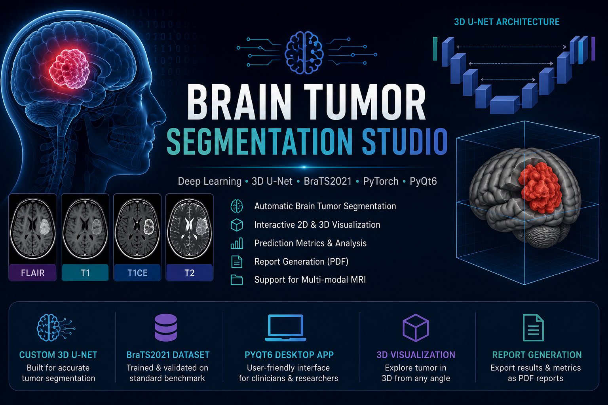
</p>
# Brain Tumor Segmentation Studio

A deep learning-based Brain Tumor Segmentation application built using a custom 3D U-Net and the BraTS2021 dataset.

## Features

- 3D U-Net model for brain tumor segmentation
- BraTS2021 MRI dataset support
- 2D MRI slice visualization
- 3D tumor visualization
- PyQt6 desktop GUI
- Tumor statistics and measurements
- PDF report generation

## Technologies Used

- Python
- PyTorch
- PyQt6
- NumPy
- Nibabel
- PyVista
- VTK

## Dataset

BraTS2021 Brain Tumor Segmentation Dataset

## Author

Pradeep Kamalanathan
# 🧠 Brain Tumor Segmentation Studio

> A desktop application for automatic brain tumor segmentation from multi-modal MRI using a custom 3D U-Net model trained on the BraTS2021 dataset.


---

# 📌 Overview

Brain Tumor Segmentation Studio is a deep learning application that automatically segments brain tumors from multi-modal MRI scans.

The project includes:

- Custom 3D U-Net implementation
- Complete training pipeline
- PyQt6 desktop application
- Interactive 2D MRI viewer
- Interactive 3D tumor visualization
- Prediction metrics
- PDF report generation

---

# 🏗 System Architecture

```
                BraTS2021 Dataset
                        │
                        ▼
             MRI Preprocessing
                        │
                        ▼
               3D U-Net Training
                        │
                        ▼
              Trained Model (.pth)
                        │
                        ▼
             Desktop GUI (PyQt6)
                        │
       ┌────────────────┴────────────────┐
       ▼                                 ▼
 2D Visualization                 3D Visualization
       │                                 │
       └──────────────┬──────────────────┘
                      ▼
            Prediction & Report Export
```

---

# ✨ Features

- ✅ Brain tumor segmentation using Custom 3D U-Net
- ✅ BraTS2021 Dataset support
- ✅ Multi-modal MRI input
  - FLAIR
  - T1
  - T1CE
  - T2
- ✅ 2D MRI slice visualization
- ✅ 3D tumor rendering
- ✅ Prediction statistics
- ✅ PDF report generation
- ✅ Interactive desktop application
- ✅ Model checkpoint loading

---

# 🖥 Application Screenshots

## Home Screen

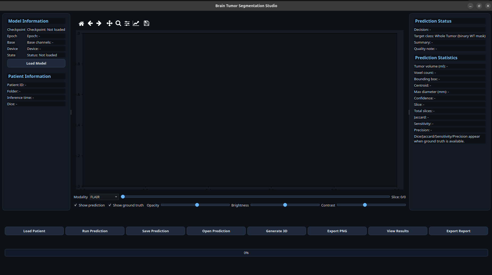

---

## Patient & Model Loading

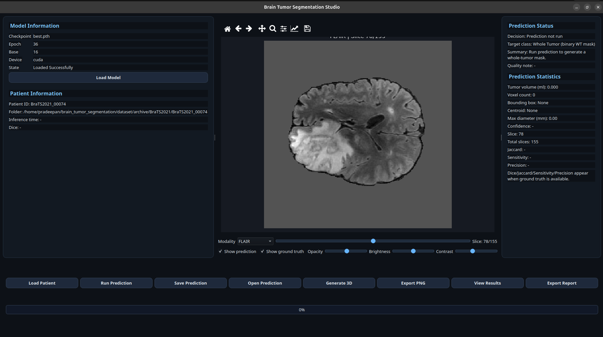

---

## Model Information

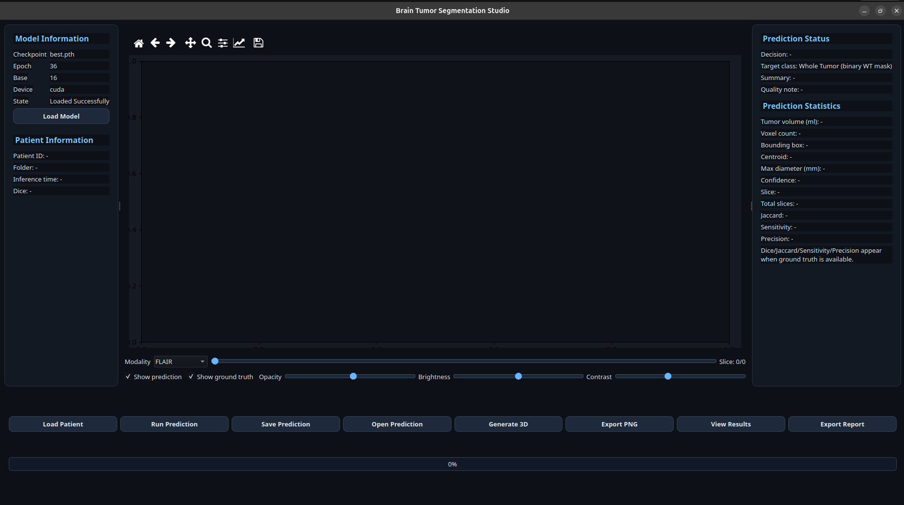

---

## Prediction

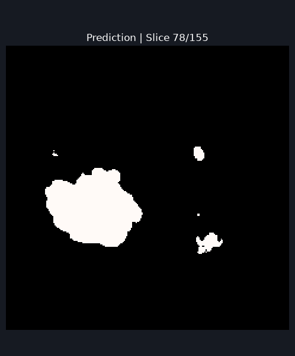

---

## 3D Tumor Visualization

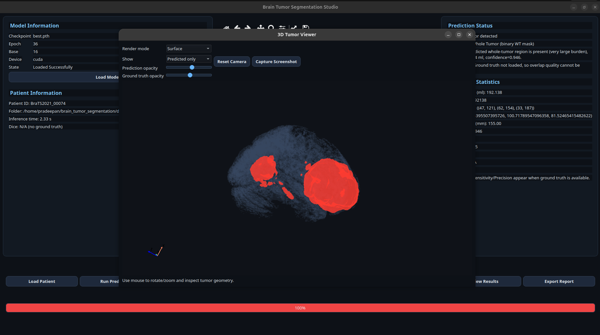

---

## 3D Surface Rendering

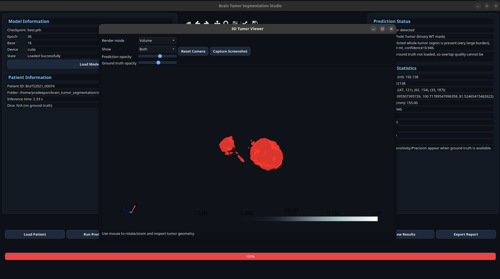

---

## 3D Wireframe

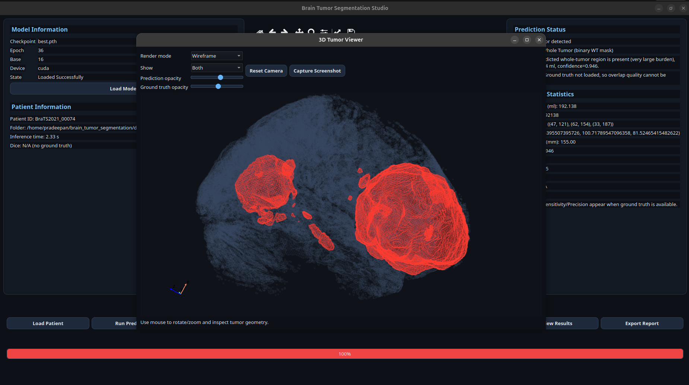

---

# 🔬 Methodology

## Input MRI

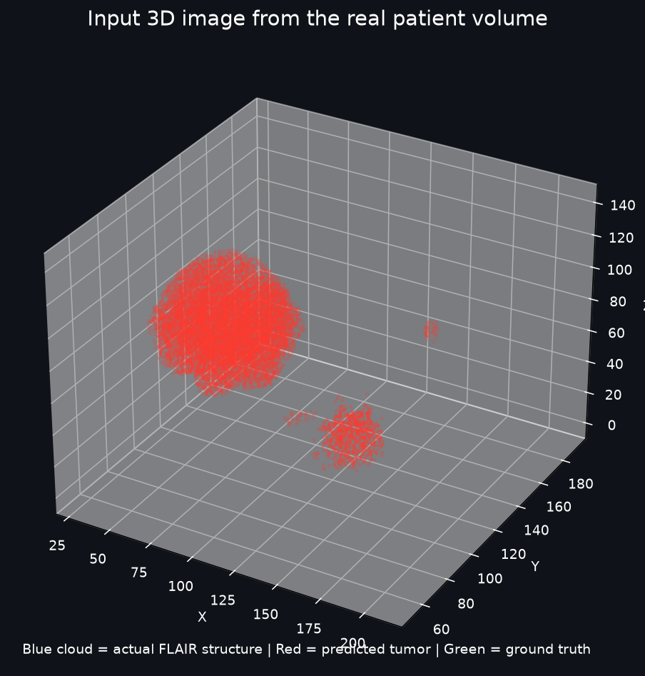

---

## Preprocessing

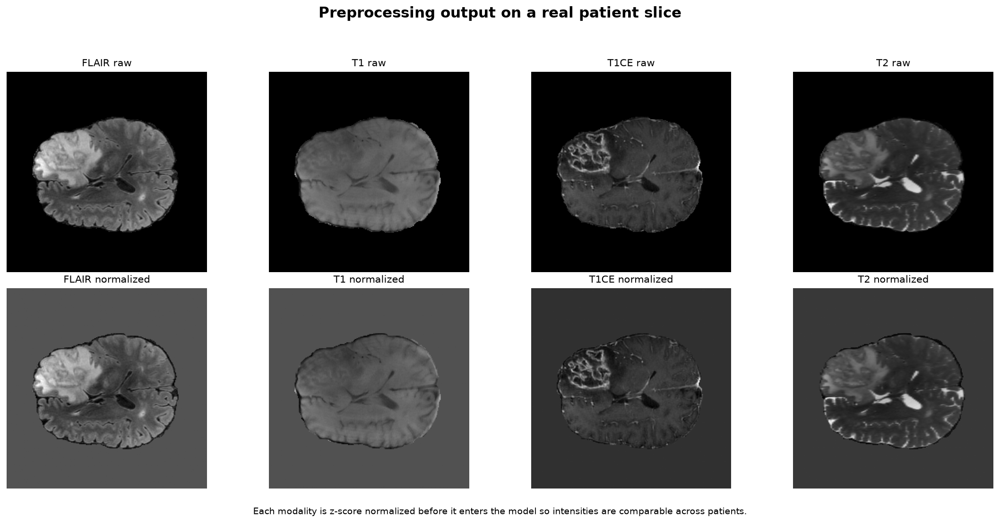

---

## Feature Extraction

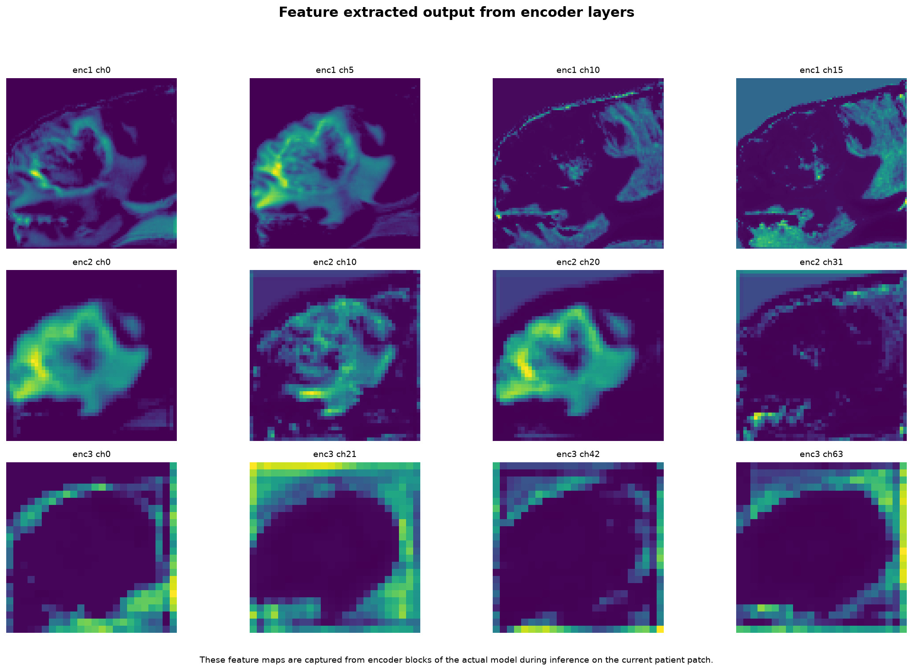

---

## Segmentation Output

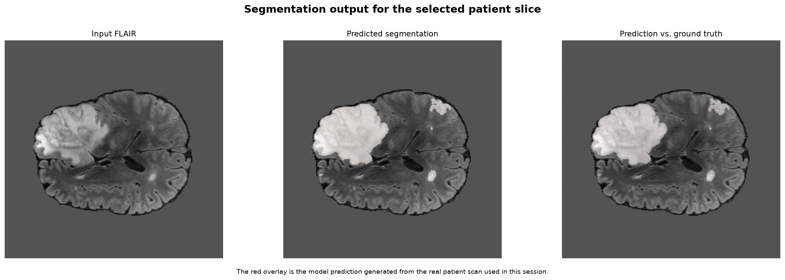

---

## Classification

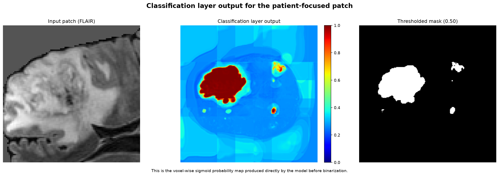

---

## Complete Pipeline

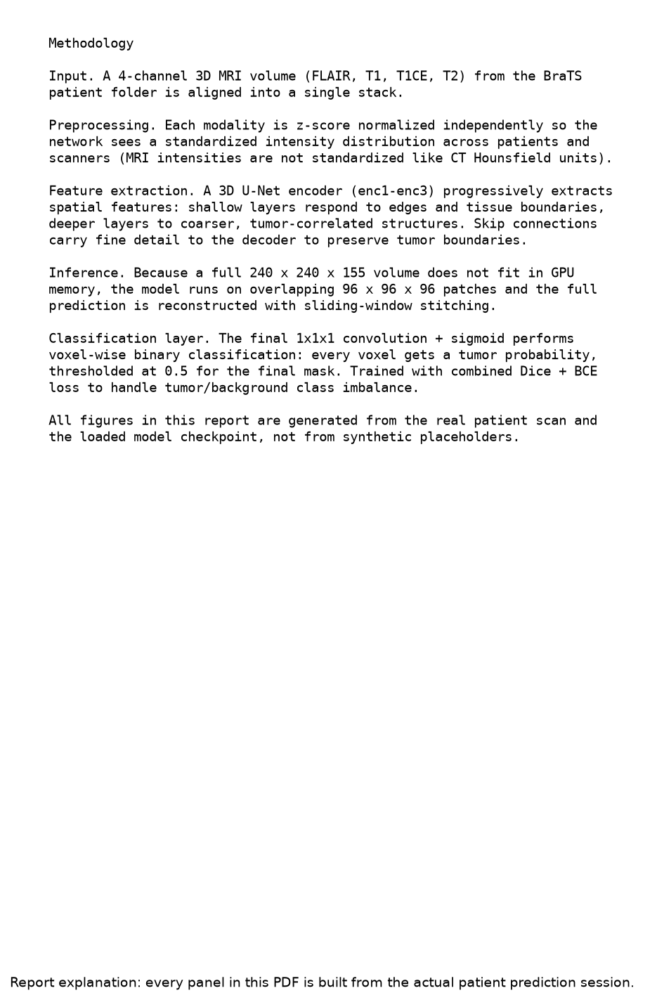

---

# 📂 Dataset

Dataset used:

**BraTS2021 (Brain Tumor Segmentation Challenge)**

MRI Modalities:

- FLAIR
- T1
- T1CE
- T2

Ground truth segmentation masks are provided for supervised learning.

Dataset is **not included** in this repository due to its size.

---

# ⚙ Installation

Clone the repository

```bash
git clone https://github.com/pradeepan-pixel/brain-tumor-segmentation-studio.git

cd brain-tumor-segmentation-studio
```

Install dependencies

```bash
pip install -r requirements.txt
```

Run GUI

```bash
python inference_app/main_gui.py
```

---

# 🚀 Usage

1. Launch the application.
2. Load a BraTS patient folder.
3. Load the trained model (`best.pth`).
4. Run prediction.
5. View segmentation in 2D.
6. Generate 3D visualization.
7. Export report.

---

# 📁 Project Structure

```
brain_tumor_segmentation
│
├── checkpoints/
├── inference_app/
├── screenshots/
├── src/
├── README.md
├── requirements.txt
└── main.py
```

---

# 🛠 Technologies Used

- Python
- PyTorch
- PyQt6
- NumPy
- Matplotlib
- Nibabel
- PyVista
- VTK

---

# 📈 Future Improvements

- Multi-class tumor segmentation
- MONAI integration
- nnU-Net support
- SwinUNETR implementation
- Docker deployment
- Web interface
- Cloud inference

---

# 👨‍💻 Author

**Pradeep Kamalanathan**

Computer Science Engineering Student

GitHub:
https://github.com/pradeepan-pixel

---

# ⭐ Support

If you found this project useful, consider giving it a ⭐ on GitHub.
